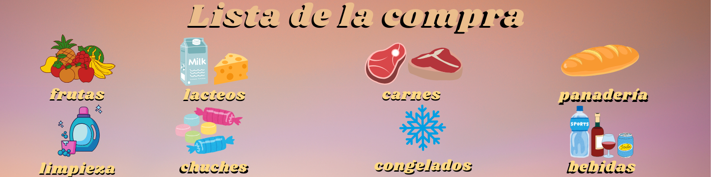

# 🛍️ Lista de la Compra Inteligente

Este proyecto es una aplicación web desarrollada con **React** que permite añadir, visualizar y organizar productos en una lista de la compra. Cada producto se clasifica automáticamente por categoría (Frutas, Lácteos, Carnes, Limpieza, Bebidas y más).  
Todos los datos se sincronizan con una **API externa** mediante `fetch`, garantizando persistencia entre sesiones.

---

## ✨ Funcionalidades

- ✅ Añadir productos con su categoría correspondiente.
- 🍎 Agrupación automática por secciones visuales.
- 🔄 Sincronización con API externa vía `fetch`.
- ❌ Eliminar productos individualmente o limpiar toda la lista.
- 📱 Interfaz visual creativa y responsiva.

---

## 💻 Tecnologías usadas

- ⚛️ React JS (`useState`, `useEffect`)
- 🎨 CSS personalizado con animaciones
- 🌐 Fetch API
- 📦 Vite como entorno de desarrollo

---

## 🧠 ¿Qué aprendí?

- 🔹 **Integración de APIs RESTful usando `fetch`**
- 🔹 **Manejo de estado dinámico con React (`useState`, `useEffect`)**
- 🔹 **Agrupación lógica de productos por categoría**
- 🔹 **Estilización avanzada con CSS animado y diseño responsivo**
- 🔹 **Enfoque en la experiencia de usuario (UX/UI)**

---

## 🧠  Demo en vivo
🟢 [Ver la aplicación desplegada en Vercel](https://lista-compra-inteligente.vercel.app)

## 📬 Conectemos
**¿Te interesa este proyecto o quieres dejar feedback?**
## 🔗 [Visita mi perfil en LinkedIn](https://www.linkedin.com/in/nelcy-garcia)

---

## 🏷️ Etiquetas
#React #Frontend #FetchAPI #ListaCompra #UXUI #BootcampProject
