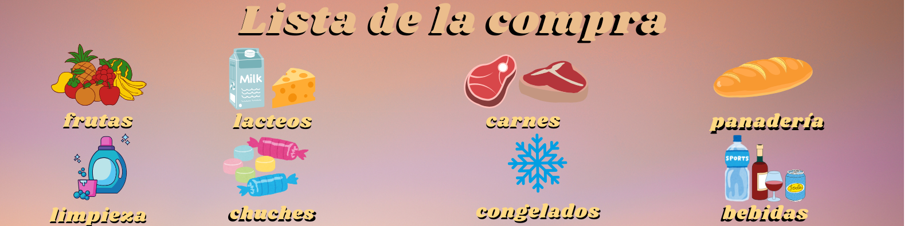

# 🛍️ Lista de la Compra Inteligente



Este proyecto es una aplicación web desarrollada con **React** que permite crear y gestionar una lista de la compra, agrupando los productos por categorías como Frutas, Lácteos, Carnes, Limpieza, y más. Todos los datos se almacenan en una API externa mediante `fetch`.

---

## ✨ Funcionalidades

- ✅ Añadir productos con categoría.
- 🍎 Agrupación por secciones con íconos (Frutas, Lácteos, etc).
- 🔄 Persistencia de datos vía API externa con `fetch`.
- 🧼 Eliminar productos uno por uno o toda la lista.
- 📱 Diseño atractivo, moderno y adaptado para móviles.

---

## 💻 Tecnologías

- React JS
- CSS personalizado con animaciones suaves
- Fetch API
- HTML5 + UX/UI

---

## 🚀 Cómo usarlo localmente

1. Clona el repositorio:
```bash
git clone https://github.com/tuusuario/lista-compra-inteligente.git


2. Instala dependencias
npm install

3. bash
npm run dev

🤓 ¿Qué aprendí?
Integrar APIs RESTful con fetch.

Manejo de estado dinámico en React.

Organización lógica de categorías.

Estilización avanzada y componentes visuales por categoría.

Mejorar la experiencia de usuario en apps pequeñas.
