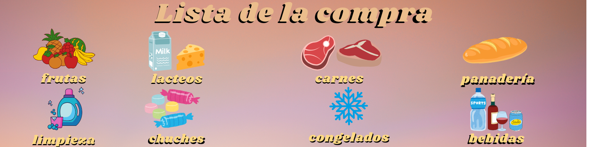

# 🛍️ Smart Shopping List

This project is a web application built with **React** that allows users to add, view, and organize products in a shopping list.  
Each item is automatically categorized (Fruits, Dairy, Meat, Cleaning, Beverages, and more).  
All data is synced with an **external API** using `fetch`, ensuring persistence between sessions.

---

## ✨ Features

- ✅ Add items with their corresponding category
- 🍎 Automatic grouping by visual sections
- 🔄 Sync with external API via `fetch`
- ❌ Delete individual items or clear the entire list
- 📱 Creative and responsive user interface

---

## 💻 Technologies Used

- ⚛️ React JS (`useState`, `useEffect`)
- 🌐 Fetch API
- 🎨 Custom CSS with smooth animations
- 📦 Vite (development environment)
- 🧠 Git + GitHub for version control

---

## 🧠 What I Learned

- 🔹 **Integration of RESTful APIs using `fetch`**
- 🔹 **Dynamic state management in React (`useState`, `useEffect`)**
- 🔹 **Logical grouping of products by category**
- 🔹 **Advanced styling with animated and responsive CSS**
- 🔹 **User experience (UX/UI)–focused design**

---

## 🌐 Live Demo

🟢 [Check out the live app on Vercel](https://lista-compra-inteligente.vercel.app)

---

## 📬 Let’s Connect

**Interested in this project or want to share feedback?**  
🔗 [Visit my LinkedIn profile](https://www.linkedin.com/in/nelcy-garcia)

---

## 🏷️ Tags

#React #Frontend #FetchAPI #ShoppingList #UXUI #BootcampProject
